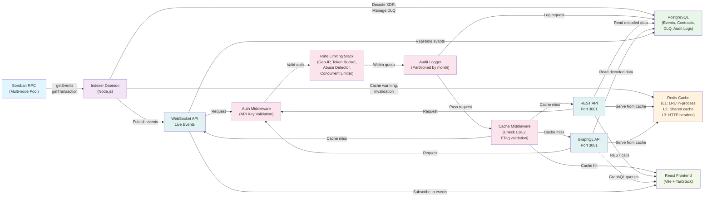

# System Architecture

This document describes the real data flow and component topology of the Soroban Smart Block Explorer.

## Data Flow Diagram

## Components

### Soroban RPC (Multi-Node Pool)

**Purpose:** Provides contract events and transaction data from the Stellar network.

**Details:**
- Configured via `config.SOROBAN_RPC_URLS` (multiple nodes for high availability)
- Primary/backup failover: switches to next healthy node if primary falls behind or times out
- Health tracking: compares node `latestLedger` against consensus; considers unhealthy if lagging >LAG_THRESHOLD ledgers
- Used by: Indexer daemon via `multiNodeRpc` client (rpcMultiNode.js)

**Failure modes:**
- All RPC nodes unhealthy (RPC node pool fully unhealthy scenario #778-2)
- Individual node lagging or timing out

### Indexer Daemon (Node.js)

**Purpose:** Consumes events from RPC, decodes them, manages failures, publishes to downstream.

**Key operations:**
1. Polls RPC for new events since last cursor (ledger sequence number)
2. For each event batch, fetches the full transaction XDR from RPC
3. Decodes raw XDR into human-readable format using the ABI registry (index.js:decode)
4. Classifies storage operations as instance/persistent/temporary via storageTierClassifier
5. On decode success: writes to `events` table in PostgreSQL, publishes to WebSocket subscribers
6. On decode failure: enqueues to `dead_letter_queue` table (deadLetterQueue.js)
   - Automatic retry with exponential backoff for transient errors (timeout, rate-limit, network)
   - Manual retry available via admin endpoints
7. Maintains cursor in DB so daemon resumes correctly after restart

**Health tracking:**
- Cursor position stored in Postgres; compared against chain tip via `/api/health` endpoint
- Lag in seconds: calculated from ledger sequence difference
- Status reported to health.js for consumption by `/api/health` endpoint

**Failure modes:**
- Indexer falls behind chain tip (scenario #778-1)
- Dead letter queue backs up (scenario #778-3)

### PostgreSQL

**Purpose:** Durable storage for decoded events, contract metadata, DLQ, audit logs.

**Key tables:**
- `events`: decoded contract events (written by indexer)
- `contracts`: registered contract metadata and ABI versions
- `dead_letter_queue`: failed events with retry tracking
  - `resolved`: boolean; null/false = retrying, true = manually resolved or auto-resolved
  - `next_retry_at`: ISO timestamp for exponential backoff
  - `retry_count`, `max_retries`: track retry attempts
- `api_audit_log`: partitioned by month; stores all API requests
  - Partitions created by monthly cron job (startAuditPartitionCron)
  - Partitions >90 days old are dropped automatically

**Failure modes:**
- Connection pool exhaustion (scenario #778-5)
- Audit log partition creation failure (scenario #778-4)

### Redis Cache (Three-Tier)

**Purpose:** Reduce load on database and improve response latency.

**Tier 1 (L1):** LRU in-process cache (per instance, sub-millisecond)
- Max size: config.CACHE_L1_MAX entries
- XFetch stampede protection: probabilistic early recomputation

**Tier 2 (L2):** Redis shared cache (<5ms per access)
- Shared across all indexer instances
- TTL by cache type (e.g., 30s for events_list, 300s for contracts_list)
- Pub/Sub for cross-instance L1 invalidation

**Tier 3 (L3):** HTTP Cache-Control headers (CDN/browser)
- Set by cacheLayer.js on successful responses
- E.g., "public, max-age=30, stale-while-revalidate=300"
- ETag support for 304 Not Modified responses

**Failure modes:**
- Redis unavailable: requests fall through to Postgres (degrades performance but doesn't break API)

### API Middleware Stack

Requests flow through this chain before reaching route handlers:

1. **Helmet (CSP, security headers):** Sets X-Frame-Options, Permissions-Policy
2. **CORS:** Validates origin; sets Access-Control-Allow-Origin
3. **Request ID:** Assigns X-Request-Id header (used for tracing)
4. **HTTP logging:** Logs method, URL, status code
5. **Metrics:** Records request duration for Prometheus
6. **API Key Auth** (apiKeyAuth.js): Validates x-api-key header if provided
   - Unauthenticated requests get lower rate limits and are tracked by IP
   - Authenticated requests get higher limits and are tracked by key
7. **Rate Limiting Stack** (in order):
   - **Geo-IP Limiter** (geoIpLimiter.js): Blocks high-risk countries (configurable)
   - **Token Bucket** (tokenBucket.js): Sustains requests-per-minute per tier
   - **Concurrent Limiter** (concurrentLimiter.js): Limits in-flight requests
   - **Abuse Detector** (abuseDetector.js): Pattern-based detection (repeated failures, suspicious IPs)
   - **GraphQL Complexity** (graphqlComplexity.js): Limits query depth/field count
   - **Rate Limit Headers** (headers.js): Adds X-RateLimit-* response headers
8. **Audit Logger** (auditLogger.js): Records request metadata (timestamp, endpoint, status, latency) to `api_audit_log`
   - Non-blocking: HTTP response sent before DB write
   - Batched flushes every 500ms for efficiency
9. **CSRF Protection** (csrf.js): Validates X-CSRF-Token header on state-changing requests (except authenticated m2m requests)
10. **Cache Middleware** (makeCache): Serves from L1/L2 cache or marks cache miss for response interception

### API Layer (Express)

**Endpoints:** `/api` base path

- **REST** (GET/POST): queries over events, contracts, wallets, tokens
- **GraphQL** (POST): complex queries with field selection
- **WebSocket** (WS): subscribe to `event`, `vault_ratio`, `contract_link` channels

**Response caching:**
- Successful (2xx-3xx) responses cached in Redis L2 with TTL by cache type
- ETag sent on all responses; client can send If-None-Match for 304
- X-Cache header indicates HIT/MISS

### Frontend (React)

**Purpose:** User-facing interface for browsing events and contracts.

**Technology:** Vite + React + TanStack Query

**API consumption:**
- REST calls to `/api` for queries (prefetch engine optimizes frequently-accessed paths)
- GraphQL queries for complex multi-resource requests
- WebSocket subscriptions for live event feed

## Incident Response

See [Incident Response Runbook](guides/incident-response-runbook.md) for diagnostic steps and remediation procedures for these failure scenarios:
1. Indexer falls behind chain tip
2. RPC node pool fully unhealthy
3. Dead letter queue backing up
4. Audit log partition creation failing
5. Database connection pool exhaustion

## Deployment Notes

- **Multi-instance:** All state is in Postgres/Redis; instances are stateless and can be scaled horizontally
- **Startup sequence:** Ensure audit partitions exist before traffic (ensureAuditPartitions on startup)
- **Monitoring:** Health checks at `/api/health` report lag, DLQ depth, worker status, active alerts
